Chào mừng đến với tài liệu **Phiên giải CTG dựa trên Sinh lý học (Physiological CTG Interpretation)**. Đây là tài liệu hướng dẫn lâm sàng đầu tiên hoàn toàn dựa trên cách tiếp cận sinh lý học để đánh giá sức khỏe thai nhi trong quá trình chuyển dạ.

## 1. Giới thiệu chung

Việc theo dõi thai nhi trong chuyển dạ chủ yếu nhằm phát hiện sớm tình trạng thiếu oxy để có hướng xử trí thích hợp, tránh tổn thương não không thể phục hồi hoặc tử vong chu sinh. Đồng thời, nó giúp hạn chế các can thiệp sản khoa không cần thiết (như mổ lấy thai cấp cứu hoặc sinh giúp bằng dụng cụ).

### Bảng viết tắt cốt lõi

Dưới đây là một số thuật ngữ viết tắt quan trọng được sử dụng xuyên suốt tài liệu:

| Viết tắt | Thuật ngữ tiếng Anh                    | Nghĩa tiếng Việt                     |
| :------- | :------------------------------------- | :----------------------------------- |
| **CTG**  | Cardio-TocoGraph                       | Biểu đồ tim thai – cơn co tử cung    |
| **FHR**  | Fetal Heart Rate                       | Nhịp tim thai                        |
| **CEFM** | Continuous Electronic Fetal Monitoring | Theo dõi tim thai điện tử liên tục   |
| **IA**   | Intermittent Auscultation              | Nghe tim thai ngắt quãng             |
| **STAN** | ST-segment Analysis                    | Phân tích đoạn ST (điện tâm đồ thai) |
| **FBS**  | Fetal Scalp Blood sample               | Mẫu máu da đầu thai nhi              |
| **IUGR** | Intra-Uterine Growth Restriction       | Thai chậm tăng trưởng trong tử cung  |

---

## 2. Các thông số CTG cốt lõi theo định nghĩa sinh lý

Việc phiên giải CTG dựa trên sinh lý tập trung vào 4 thông số chính của nhịp tim thai:

### 2.1. Nhịp cơ bản (Baseline FHR)

Nhịp tim thai trung bình khi không có cơn co tử cung và các thay đổi chu kỳ (như nhịp tăng hay nhịp giảm).

- **Bình thường:** **110 – 160 nhịp/phút (bpm)**.
- **Nhịp nhanh (Tachycardia):** $> 160$ bpm kéo dài trên 10 phút. Thường do mẹ sốt, nhiễm trùng tử cung (viêm màng ối), mất nước, thuốc cường beta, hoặc đáp ứng bù trừ sớm của thai với thiếu oxy.
- **Nhịp chậm (Bradycardia):** $< 110$ bpm kéo dài trên 10 phút. Cần phân biệt nhịp chậm thực sự với việc đầu dò ghi nhầm nhịp tim mẹ.

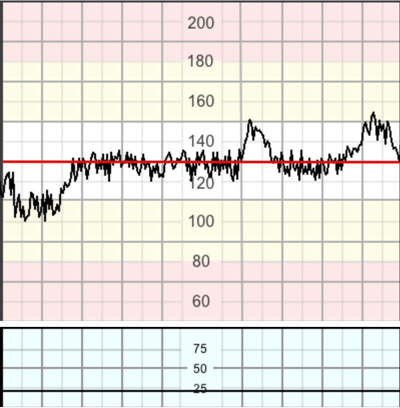

### 2.2. Dao động nội tại (Variability)

Sự dao động tự nhiên của tín hiệu nhịp tim thai, phản ánh sự tương tác liên tục giữa hệ thần kinh giao cảm và phó giao cảm.

- **Bình thường:** Biên độ dải từ **5 – 25 bpm**. Thể hiện một thân não được tưới máu tốt và hệ thần kinh tự chủ hoạt động bình thường.

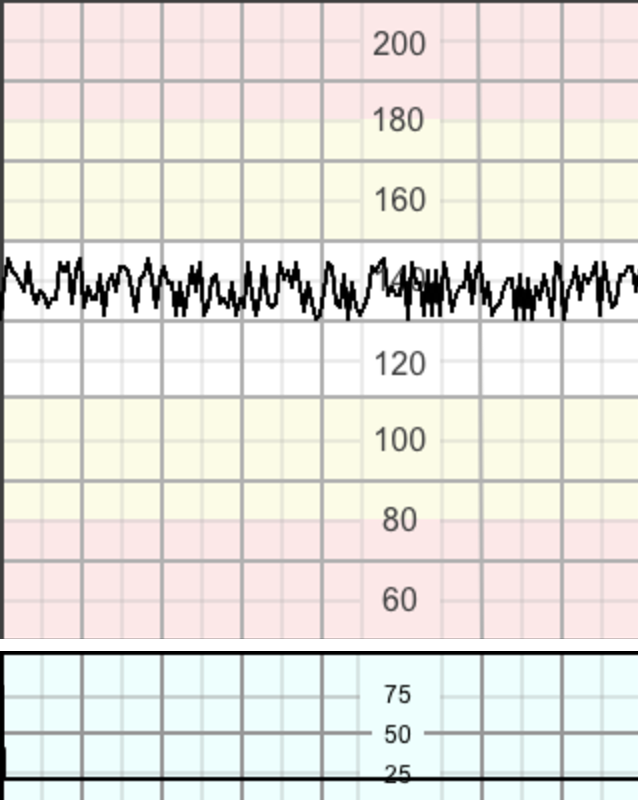

- **Giảm dao động:** Biên độ dải dưới 5 bpm kéo dài trên 50 phút ở đoạn nhịp cơ bản, hoặc trên 3 phút trong các nhịp giảm.

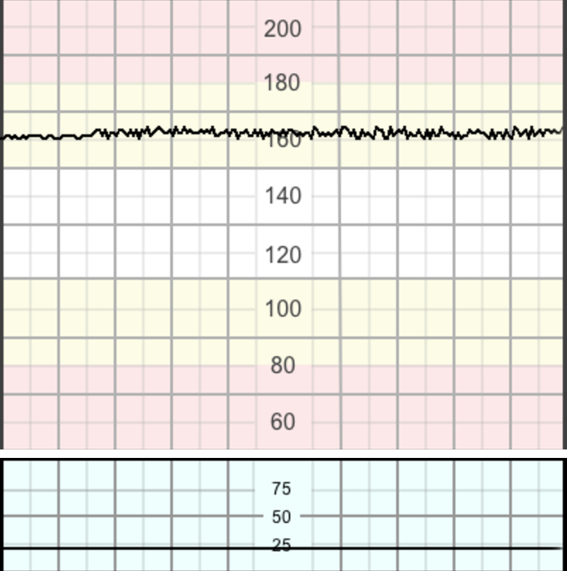

- **Mất dao động (Absent):** Không phát hiện được khoảng biên độ, là dấu hiệu cực kỳ nghiêm trọng.
- **Kiểu nhảy (Saltatory pattern):** Biên độ dao động vượt quá 25 bpm kéo dài trên 30 phút. Thường do sự mất ổn định của hệ thần kinh tự chủ khi thiếu oxy tiến triển nhanh.

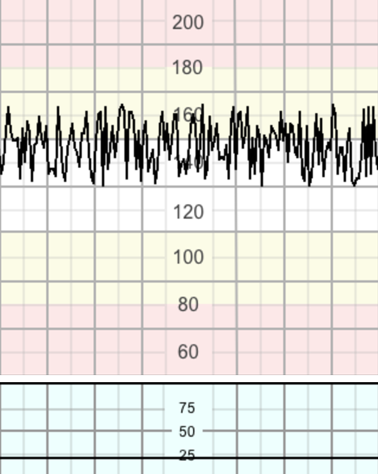

- **Kiểu hình sin (Sinusoidal pattern):** Sóng trơn, gợn sóng đều đặn như hình sin, biên độ 5–15 bpm, kéo dài $> 30$ phút và mất nhịp tăng. Đây là dấu hiệu của thiếu máu thai nặng hoặc ngạt cấp.

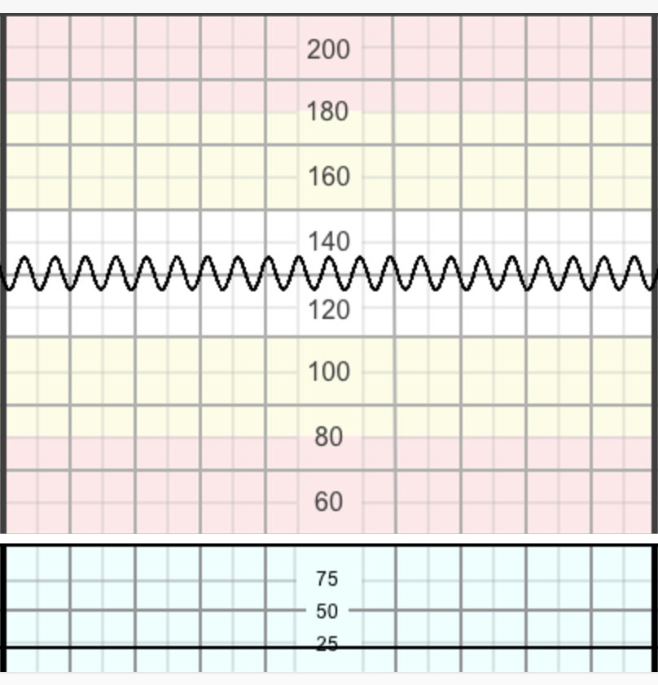

- **Kiểu giả hình sin (Pseudo-sinusoidal pattern):** Kiểu hình giống hình sin nhưng có dạng răng cưa lởm chởm hơn thay vì dạng sóng sin trơn.

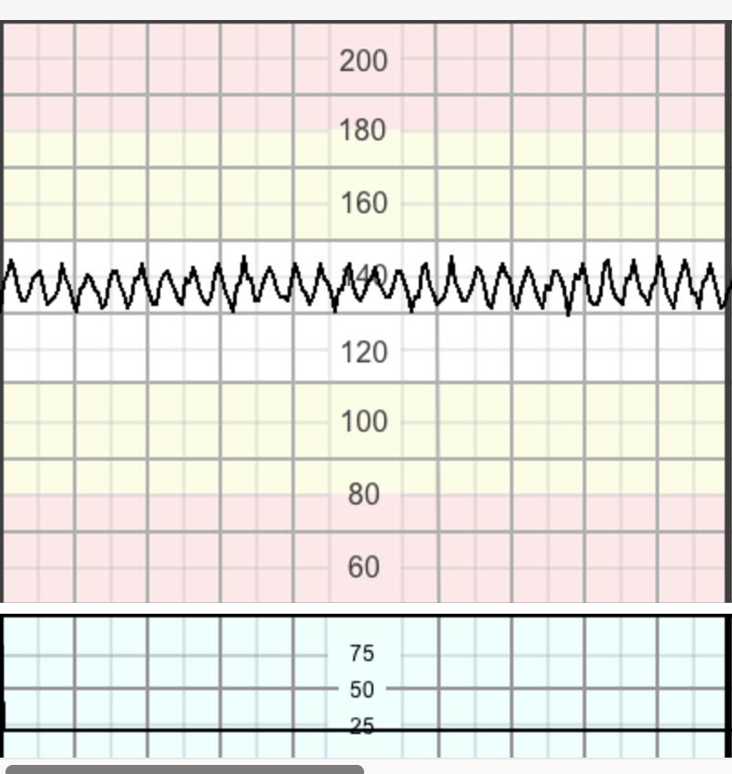

### 2.3. Nhịp tăng (Accelerations)

Sự tăng đột ngột (từ lúc bắt đầu đến đỉnh $< 30$ giây) của nhịp tim thai lên trên nhịp cơ bản.

- **Biên độ:** $\ge 15$ bpm và kéo dài $\ge 15$ giây (ở thai trước 32 tuần, tiêu chuẩn có thể là 10 bpm / 10 giây).
- Sự hiện diện của các nhịp tăng cho thấy thai nhi đang thức, khỏe mạnh và không bị toan hóa.

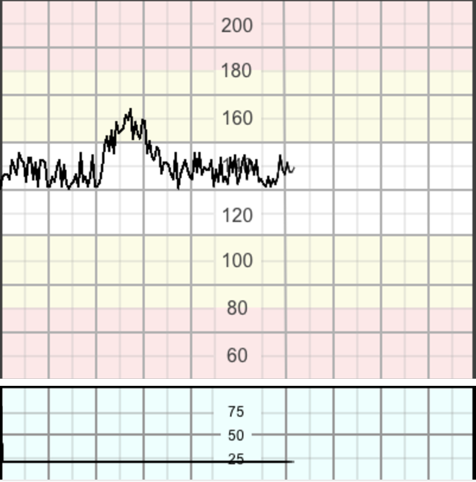

### 2.4. Nhịp giảm (Decelerations)

Sự giảm nhịp tim thai xuống dưới nhịp cơ bản với biên độ $> 15$ bpm và kéo dài từ 15 giây trở lên. Nhịp giảm là một phản xạ bảo vệ của thai nhi để giảm tải công việc cho cơ tim trong điều kiện thiếu oxy hoặc stress cơ học.

- **Nhịp giảm sớm (Early Decelerations):** Giảm từ từ, trùng khớp hoàn toàn với cơn co tử cung (đáy nhịp giảm tương ứng đỉnh cơn co). Do chèn ép đầu thai gây phản xạ phế vị, không chỉ điểm thiếu oxy.

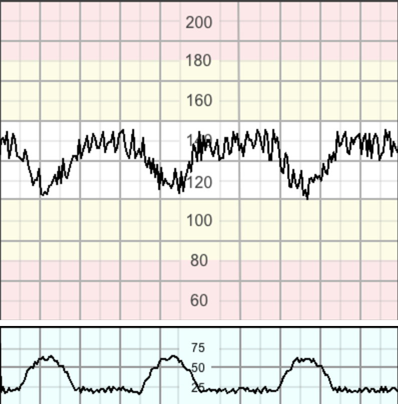

- **Nhịp giảm biến đổi (Variable Decelerations):** Giảm đột ngột hình chữ V (khởi phát đến đáy $< 30$ giây). Thường do chèn ép dây rốn tạm thời. Đạt tiêu chuẩn "sixties" (giảm $\ge 60$ bpm, kéo dài $\ge 60$ giây, hoặc chạm mức $\le 60$ bpm) nếu chèn ép kéo dài và nặng.

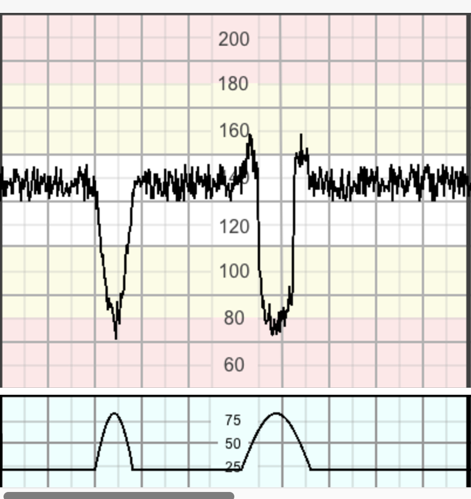

- **Nhịp giảm muộn (Late Decelerations):** Giảm từ từ và xuất hiện muộn hơn cơn co tử cung (đáy nhịp giảm lệch sau đỉnh cơn co). Chỉ điểm tình trạng thiếu oxy máu thai nhi (co mạch ngoại biên qua trung gian thụ thể hóa học).

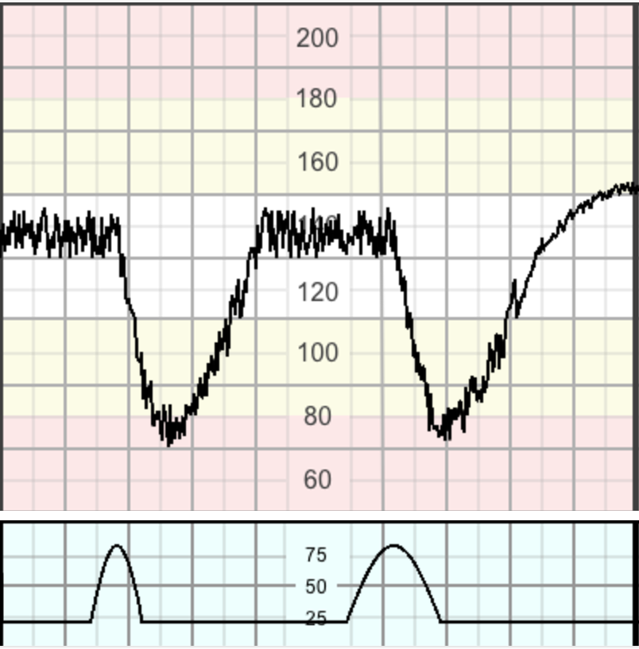

- **Nhịp giảm kéo dài (Prolonged Decelerations):** Kéo dài trên 3 phút. Nếu giảm kéo dài hơn 5 phút với nhịp tim duy trì dưới 80 bpm, nguy cơ tổn thương não hoặc tử vong là rất cao nếu không xử trí khẩn cấp.

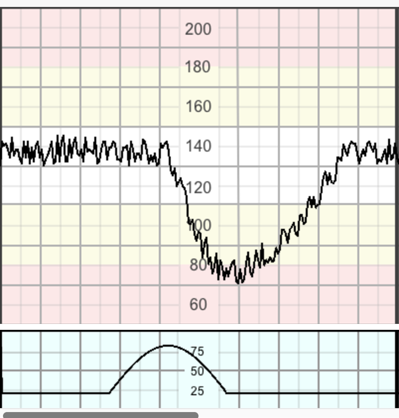

### 2.5. Quy tắc 3 phút đối với Nhịp giảm kéo dài

Nhịp giảm vượt quá 5 phút với nhịp tim thai duy trì dưới 80 bpm và dao động nội tại giảm trong nhịp giảm thường liên quan thiếu oxy/toan hóa thai cấp và cần can thiệp khẩn cấp (Quy tắc 3 phút).

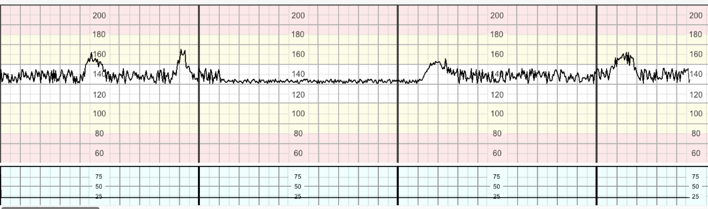
